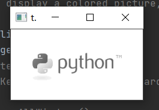
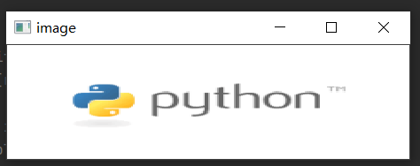
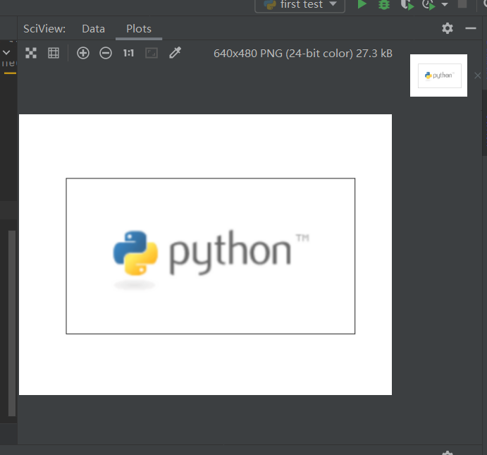

#OpenCV notes by BryanD  
##1.To begin with  
&ensp;&ensp;To start learning OpenCV, first you'll need to install it.<br>
You can install opencv-python by just simply run <br>
`pip install opencv-python` <br>
&ensp;&ensp;If you are lucky enough,you will be ready to begin using opencv for<br>
python, but in most cases, you'll have to use this command instead<br>
`pip install -i https://pypi.tuna.tsinghua.edu.cn/simple opencv-python`<br>
&ensp;&ensp;You can test if you have successfully installed opencv-python by <br>
`import cv2 as cv`
##2.Image I/O
###1.read in
&ensp;&ensp;You can use **imread(arg_filepath, arg_flag)** to read an image.<br>
> - arg_filepath: string, the path of the image.
> - arg_flag: int, decides the mode to open the image
>   - cv.IMREAD_COLOR or just 1: load the color image, default
>   - cv.IMREAD_GRAYSCALE or just 0: load the image in grayscale
>   - cv.IMREAD_UNCHANGED or just -1: load the image with alpha channel

&ensp;&ensp;Here's an example of reading an image from directory.
```python
import cv2 as cv

img = cv.imread('./image/2.jpg')
```
###2.display
&ensp;&ensp;Use **imshow(arg_title, arg_target)** to display the image we have opened.
> - arg_title: string, the title of the display window
> - arg_target: object, the handle of the file

&ensp;&ensp;Here's an example.
```python
import cv2 as cv

img = cv.imread('./image/2.jpg')
cv.imshow('test', img)
cv.waitKey(0)  # wait for keyboard action
cv.destroyAllWindows()  # destroy all windows we created
```

<br>
&ensp;&ensp;Sometimes the original image is too big or too small.To solve that, you can first<br>
name an empty window, then load image to it.In that case, you can create a window <br>
that is alterable by using flag "**cv.WINDOW_NORMAL**"
```python
import cv2 as cv

img = cv.imread('./image/2.jpg')
cv.namedWindow('image', cv.WINDOW_NORMAL)
cv.imshow('image', img)
cv.waitKey(0)
cv.destroyAllWindows()
```
<br>
###3.save the image
&ensp;&ensp;You can use **imwrite(arg_filename, arg_target)** to save the image.
> - arg_filename: string, the new image's filename
> - arg_target: object, the image you want to save.

###4.using matplotlib
&ensp;&ensp;You can also use matplotlib to display the image. Especially when you<br>
use PyCharm Professional you can use the built-in SciView.
```python
import cv2 as cv
from matplotlib import pyplot as plt
img = cv.imread('./image/2.jpg')

# opencv follows BGR order, and matplotlib follows RGB order. So if
# you want to display a colored picture with matplotlib, you'll need to convert it to
# RGB mode.
b, g, r = cv.split(img)
img2 = cv.merge([r, g, b])

plt.imshow(img2, interpolation='bicubic')
plt.xticks([]), plt.yticks([])
plt.show()
```
<br>

##3.Video I/O


